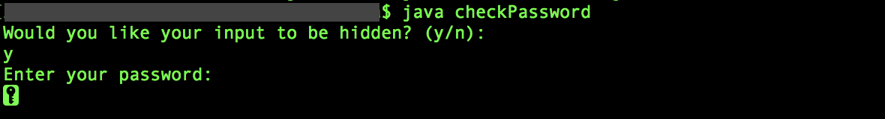
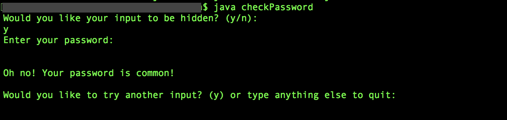

# Common Password Checker (checkPassword)
This Java program takes a password as input from the user and checks if it is common. Specifically, it searches for the inputted password in the rockyou.txt file, which is a list of passwords that was made publically available when company RockYou was hacked in 2009. The program allows for the user to keep the input visible or hidden in the Terminal. It can repeat and allow the user to check different inputs until they wish to stop. This should be used for educational purposes only.

## Usage
First, you can find the rockyou.txt file by downloading it from the link contained in downloadLink.txt or by clicking [here](https://github.com/brannondorsey/naive-hashcat/releases/download/data/rockyou.txt
). Please place it in the same folder as the checkPassword files found within this Git repository.

The Java program can then be run with the following commands in the Terminal:
```
javac checkPassword.java
java checkPassword
```
## Example


